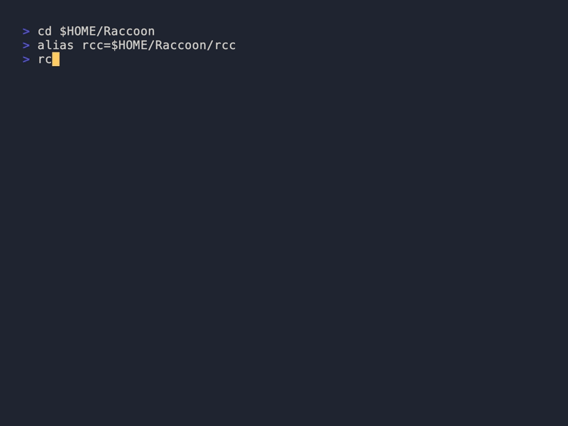

# 🦝 Raccoon

<p align="center">
  
</p>

> macOS companion toolkit — system info, security audits, dev tools, all from one terminal.

[](https://github.com/thousandflowers/Raccoon/actions/workflows/ci.yml)
[](LICENSE)
[](ui/)

Zero dependencies beyond macOS + git. 1500+ lines of shellcheck-clean Bash.

---

## Install

```bash
curl -fsSL https://raw.githubusercontent.com/thousandflowers/Raccoon/main/install.sh | bash
```

Or via Homebrew:

```bash
brew install thousandflowers/raccoon/rcc
```

Run `rcc` to launch the interactive menu, or `rcc <command>` for direct access.

<details>
<summary>Update & uninstall</summary>

**Update:**

```bash
# Homebrew
brew upgrade rcc

# curl install — re-run the installer
curl -fsSL https://raw.githubusercontent.com/thousandflowers/Raccoon/main/install.sh | bash
```

**Uninstall:**

```bash
# Homebrew
brew uninstall rcc

# curl install
rm -rf ~/.raccoon && rm "$(which rcc)"
```
</details>

---

## What you can do

### 🔒 Security audit

30+ checks across Core Security, Network, Auth, Persistence, Privacy, and more.

```bash
rcc audit                 # quick scan
rcc audit deep            # full scan (requires sudo)
rcc audit --fix           # auto-fix common issues
rcc audit --json          # machine-readable output
rcc audit --csv           # spreadsheet-ready
rcc audit --html          # save as HTML report
rcc audit --report out    # save report to file
rcc audit history         # view past audits
rcc audit --diff          # changes since last audit
rcc audit watch           # schedule weekly scan via LaunchAgent
```


### 🖥️ System information

```bash
rcc disk                  # internal, external & network drives, SMART
rcc network               # interfaces, Wi‑Fi, DNS, routing
rcc memory                # system stats + processes sorted by RAM
rcc ports                 # open ports & listening services
rcc battery               # health %, cycles, temperature
rcc backup                # Time Machine status
```

### 🛠️ Developer tools

```bash
rcc upgrade               # update brew, pip, npm, gem at once
rcc upgrade --dry-run     # preview upgrades without running them
rcc ssh                   # inspect keys, --export, --export-gpg
rcc git                   # status, branches, stash, cleanup
rcc docker                # images, containers, volumes
rcc xcode                 # simulators, derived data, SPM caches
```

### 🧹 Maintenance

```bash
rcc env                   # shell environment & PATH breakdown
rcc startup               # launch agents & login items
rcc trash                 # trash size & empty
rcc fonts                 # find duplicates & corrupted fonts
rcc history               # shell history analysis
rcc certs                 # SSL certificate expiry report
```

---

## All commands

| Command | Description |
|---------|-------------|
| `audit` | Security audit (30+ checks) |
| `audit deep` | Full audit with sudo |
| `audit fix` | Auto-fix security issues |
| `battery` | Health, cycles, temperature |
| `backup` | Time Machine status |
| `certs` | SSL certificate expiry |
| `disk` | Internal, external & network drives, SMART |
| `docker` | Images, containers, volumes |
| `env` | Shell environment & PATH |
| `fonts` | Font duplicates & issues |
| `git` | Status, branches, stash |
| `history` | Shell history analysis |
| `memory` | System memory + process RSS |
| `network` | Interfaces, Wi‑Fi, DNS |
| `ports` | Open ports & listeners |
| `ssh` | Key inspection, `--export`, `--export-gpg` |
| `startup` | Launch agents & login items |
| `trash` | Trash contents & size |
| `upgrade` | Multi‑package update |
| `xcode` | Simulators, caches, SPM |

---

## Go TUI

Raccoon ships an optional terminal UI built with [Bubble Tea](https://github.com/charmbracelet/bubbletea):

```
┌──────────────────────────────────────────────┐
│ Raccoon                                      │
│ macOS companion toolkit                      │
│                                              │
│ upgrade    audit      network    disk        │
│ memory     ssh        git        ports       │
│ battery    backup     env        startup     │
│ trash      fonts      history    certs       │
│ docker     xcode                             │
│                                              │
│ ←→ Navigate · ↑↓ Rows · Enter Run · Q Quit   │
└──────────────────────────────────────────────┘
```

Compile with `cd ui && ./build.sh`. The binary lands in `bin/rcc-ui` and is auto-detected by `rcc`.

---

## Shell completion

```bash
rcc completion bash    # print bash completions
rcc completion zsh     # print zsh completions
```

Pipe into your shell rc file to make it permanent:

```bash
rcc completion bash >> ~/.bashrc
rcc completion zsh  >> ~/.zshrc
```

---

## Man page

```bash
man rcc
```

Covers every command, flag, and example.

---

## Project structure

```
Raccoon/
├── rcc                  # Entry point + dispatcher
├── install.sh           # curl | bash installer
├── lib/core/            # Shared shell library
│   ├── common.sh
│   └── commands.sh
├── bin/                 # Command scripts (audit, disk, …)
├── ui/                  # Go Bubble Tea TUI
├── completions/         # bash + zsh autocompletions
├── man/man1/rcc.1      # Man page
├── tests/               # Bats test suite
└── docs/                # Images, GIFs, guides
```

---

## Contributing

Bug reports and PRs welcome — use the templates.

```bash
brew install bats-core shellcheck
bats tests/              # run tests
shellcheck rcc bin/*.sh lib/core/*.sh   # lint
```

---

## License

MIT — see [LICENSE](LICENSE).
