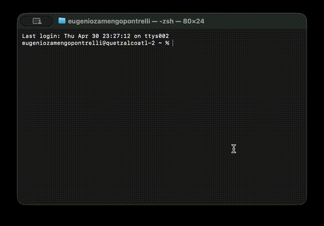
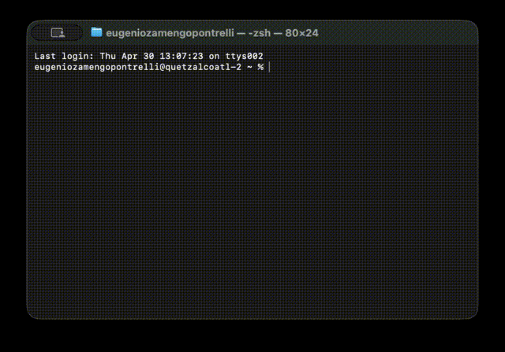
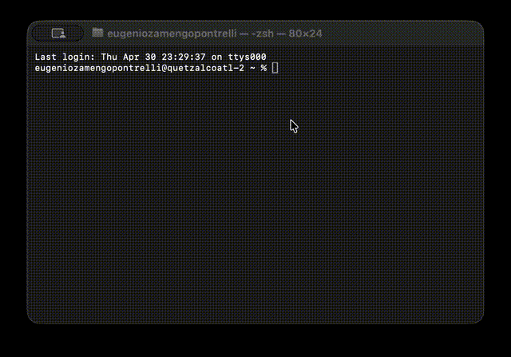

# 🦝 Raccoon

[](https://github.com/thousandflowers/Raccoon)
[](LICENSE)
[](https://www.apple.com/macos/)

> **The macOS companion toolkit that power users deserve.**

Single CLI. 18 commands. Real-time progress bars. Interactive search.  
Your Mac's health, network, security, and packages — all in one place.

---

## 🎬 See it in action



**↑ This is Raccoon.** No config files. No dependencies. Just `rcc`.

---

## 🚀 Install in 10 seconds

```bash
curl -fsSL https://raw.githubusercontent.com/thousandflowers/Raccoon/main/install.sh | bash
```

That's it. `rcc` is now in your PATH.

### Requirements

- macOS 11+ (Big Sur or later)
- `git` (for installation)
- Go 1.21+ (only if you want to modify and recompile the UI manually)

The installer handles Go compilation automatically — no manual build step required.

---

## ✨ Why Raccoon?

| ⚡ Fast | 🔍 Searchable | 📊 Visual |
|:------:|:-----------:|:--------:|
| One command gets you everything. | Press `/` to filter 18+ commands instantly. | Progress bars show real-time status. |
| No config files to manage. | Case-insensitive, searches name + description. | Output scrolls cleanly below the bar. |
| Runs on stock macOS tools. | Menu reappears after execution. | Final summary with tables & ASCII boxes. |

---

## 📊 The Global Progress Bar



**No more messy terminal output.** Raccoon shows:

- `[██████████░░] 2/6 managers` — single global bar
- `brew: upgrade deno` — live status parsed from command output
- `==> Downloading... 60%` — command output scrolls below

Commands with multi-step operations (`upgrade`, `audit`, `git`, `docker`) display the progress bar automatically. After completion, formatted results appear as tables or ASCII boxes.

---

## 🎮 Interactive Menu



**Launch:** `rcc` with no arguments  
**Search:** Press `/` then type (e.g., `up` → `upgrade`)  
**Navigate:** Arrow keys or `h/j/k/l`  
**Run:** `Enter`  
**Quit:** `q`

**Features:**
- **Dynamic Grid** — columns adapt automatically based on filtered results
- **Persistent Output** — after running a command, the output remains visible and the menu reappears below it
- **Bash Fallback** — if Go is not available, a bash-based menu with full search functionality launches automatically

---

## 📚 Commands

| Command | Description |
|---------|-------------|
| **Core Tools** | |
| `upgrade` | Update Homebrew, pip, npm, gem, and other package managers |
| `upgrade --dry-run` | Show what would be upgraded without updating |
| `audit` | Security audit (30 checks: Core, Network, Auth, Persistence, Additional) |
| `audit deep` | Full audit (+ Privacy checks: Location Services, Analytics) |
| `audit quiet` | Audit output just counts: "pass warn fail" |
| `audit fix` | Auto-fix common security issues |
| `audit json` | Audit output in JSON format |
| `audit history` | Show audit history with diff |
| `audit watch` | Schedule weekly audit via LaunchAgent |
| **System** | |
| `network` | Network interfaces, Wi-Fi signal, DNS, routing |
| `disk` | Disk space, APFS container, SMART status |
| `memory` | Processes sorted by memory usage |
| `ports` | Open ports and listening services |
| `battery` | Battery health, cycle count, temperature |
| `backup` | Time Machine status and last backup date |
| **Developer** | |
| `ssh` | SSH key generation and management |
| `git` | Git status, branches, stash, and cleanup |
| `docker` | Docker images, containers, volumes |
| `xcode` | Simulators, derived data, SPM packages |
| **Maintenance** | |
| `env` | Shell environment and PATH summary |
| `startup` | Launch agents and login items |
| `trash` | Trash contents and size |
| `fonts` | Font duplicates and corrupted fonts |
| `history` | Shell command history analysis |
| `certs` | SSL certificates and expiration |
| **Meta** | |
| `--version` / `-V` | Print Raccoon version |
| `help` / `--help` / `-h` | Show help |

### Audit Options

| Option | Description |
|--------|-------------|
| `--deep` | Run all 32 security checks (requires sudo) |
| `--quiet` | Output just "pass warn fail" counts |
| `--json` | Output in JSON format |
| `--csv` | Output in CSV format |
| `--html` | Output as HTML report |
| `--report FILE` | Save report to file |
| `--fix` | Auto-fix issues where possible |
| `--fix --dry-run` | Show what would be fixed |
| `--fix --force` | Skip confirmation prompts |
| `--history` | Show audit history with diff |
| `--diff` | Show changes since last audit |
| `--watch` | Schedule weekly audit run |
| `--notify` | Send notification on completion |

---

## 🏗️ How it works

Raccoon is built with two layers:

- **Core (Bash)** — 18 command scripts in `bin/` plus shared utilities in `lib/core/`. Every command works standalone via `rcc <command>`.
- **TUI (Go + Bubble Tea)** — Optional interactive menu in `ui/` that launches automatically. Compiles on install, falls back to a bash-based menu if Go is unavailable.

The progress bar infrastructure lives in `lib/core/common.sh` and is used by `upgrade`, `audit`, `git`, and `docker` to stream real-time output without breaking the terminal layout.

---

## 🔄 Update

```bash
curl -fsSL https://raw.githubusercontent.com/thousandflowers/Raccoon/main/install.sh | bash
```

Or manually:

```bash
cd ~/.raccoon && git pull
```

---

## 🗑️ Uninstall

```bash
rm -rf ~/.raccoon
rm /usr/local/bin/rcc   # or ~/.local/bin/rcc
```

---

## 📜 License

MIT © [thousandflowers](https://github.com/thousandflowers)
