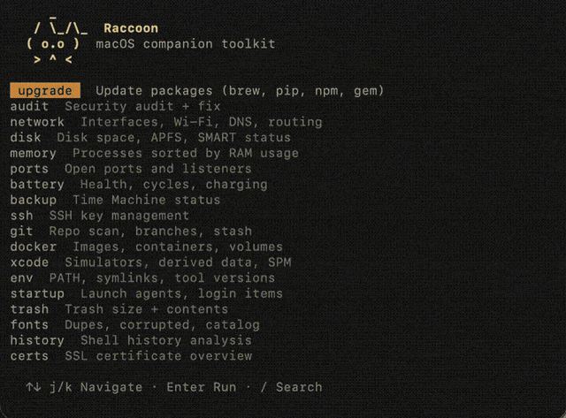
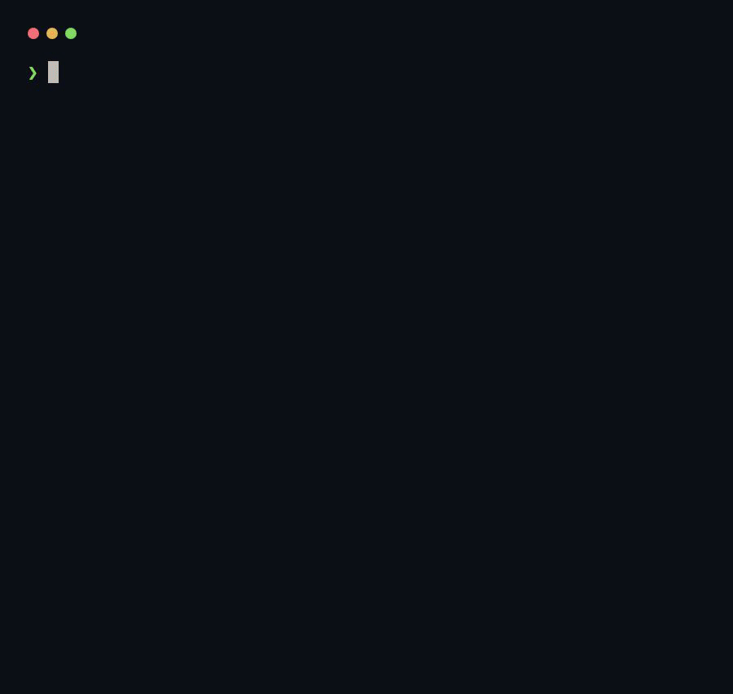

<p align="center">
  
</p>

# 🦝 Raccoon

> **Security audits, system info & SSH fleet management for macOS.**
> *For the people who maintain Macs they don't sit in front of - and need to show their work.*

[](https://github.com/thousandflowers/Raccoon/actions/workflows/ci.yml)
[](https://github.com/thousandflowers/Raccoon/releases/latest)
[](LICENSE)

The CLI has zero runtime dependencies beyond macOS + git - Go is needed only to build the optional TUI. ~6,500 lines of shellcheck-clean Bash across 21 command scripts, covered by 38 bats test files. Runs on the system Bash (3.2 → 5.x) - no Homebrew required.

---

## Why I built this

It started as a PR to [Mole](https://github.com/tw93/Mole): a `mo update` that bumped brew, pip, npm, and gem in one shot. The maintainer liked it but declined it as out of scope.

So I merged it with the script I already ran on my sisters' Macs - disk space, open ports, startup items - and kept adding commands. It now writes client reports and audits a room of Macs over SSH, but it's still the same tool: just the things I needed.

---

## Contents

- [Install](#install)
- [What you can do](#what-you-can-do)
- [Fleet management](#️-fleet-management)
- [All commands](#all-commands)
- [Why Raccoon is different](#why-raccoon-is-different)
- [How it compares](#how-it-compares)
- [What Raccoon is not](#what-raccoon-is-not)
- [Is it safe to pipe to `bash`?](#is-it-safe-to-pipe-to-bash)
- [Go TUI](#go-tui)
- [Shell completion](#shell-completion) · [Man page](#man-page) · [Project structure](#project-structure) · [Contributing](#contributing)

---

## Install

Via Homebrew (recommended):

```bash
brew install thousandflowers/raccoon/rcc
```

Or grab the single self-contained file - no git, no clone (CLI only; the
interactive TUI needs Homebrew or the source install below):

```bash
curl -fsSL https://github.com/thousandflowers/Raccoon/releases/latest/download/rcc -o rcc
chmod +x rcc
./rcc audit
```

Or install from source with the one-file installer - it clones to `~/.raccoon`
and symlinks `rcc`, nothing else ([is piping to `bash` safe?](#is-it-safe-to-pipe-to-bash)):

```bash
curl -fsSL https://raw.githubusercontent.com/thousandflowers/Raccoon/main/install.sh | bash
```

Run `rcc` to launch the interactive [menu](#go-tui), or `rcc <command>` for direct access.

<details>
<summary>Update &amp; uninstall</summary>

**Update:**

```bash
brew upgrade rcc                                                                   # Homebrew
curl -fsSL https://raw.githubusercontent.com/thousandflowers/Raccoon/main/install.sh | bash   # curl install
```

**Uninstall:**

```bash
brew uninstall rcc                          # Homebrew
rm -rf ~/.raccoon && rm "$(which rcc)"      # curl install
```
</details>

---

## Requirements

- **macOS** on Apple Silicon or Intel, with the built-in `bash` (3.2+) - nothing extra to install for the core commands.
- **git** - used by the curl installer and by `rcc git`.
- **Optional, per command:** `mas` (App Store updates in `rcc apps`), `gpg` (`rcc ssh --export-gpg`), `docker` (`rcc docker`), Homebrew (`rcc upgrade` / `apps`), and Go (only to build the TUI).

---

## What you can do

### 🔒 Security audit

```bash
rcc audit                 # 30+ security checks (Gatekeeper, firewall, SIP, sharing…)
rcc audit --fix           # apply safe fixes — every change is backed up first
rcc audit --deep          # add slower, deeper checks
rcc audit --json          # machine-readable output (also: --csv, --report file.md)
rcc audit --baseline      # snapshot now; later runs diff against it
rcc audit --verbose       # show the exact command + raw output behind each check
rcc audit --cis           # map checks to the CIS Apple macOS Benchmark + coverage
rcc audit --only core,network   # run only some check groups (--list-checks to list)
rcc audit --report out.html     # auditor-ready self-contained HTML report
```

Per-client reports with `--client`, `--shop`, `--tech` and reusable profiles
(`rcc audit --profile mario-bianchi`). `--fix` backs every change up to
`~/.raccoon/fix-backups/<timestamp>/` first, and schedules itself with
`rcc audit schedule weekly` (LaunchAgent).

**Exit codes** (for CI/automation, on both `rcc audit` and `rcc fleet audit`):
`0` all passed · `1` at least one failure · `2` warnings only (or a usage
error). `--verbose` re-runs each check's documented command live so an auditor
can verify findings instead of trusting the summary; the same command is shown
in `--json` (the `command` field) and the HTML report.

```
$ rcc audit
  Security Audit · 2026-06-26 14:30

  ✓ FileVault            Enabled
  ✓ Gatekeeper           Enabled
  ✓ SIP                  Enabled
  ⚠ Firewall             On — stealth mode off
  ✓ Screen Lock          Locks immediately
  ⚠ Sharing              Remote Login (SSH) enabled
  ✗ Software Updates     3 updates pending
  …
  ────────────────────────────────────────────
  28 passed · 3 warnings · 1 failed
  Run `rcc audit --explain` for the why behind each finding
```


<details>
<summary>What gets checked (30+)</summary>

- **System:** FileVault, SIP, Gatekeeper, XProtect, Firewall, Stealth Mode, Software Updates, Screen Lock, Auto-Login
- **Network:** Sharing, Open Ports, SSH Daemon, DNS Servers, DNS-over-HTTPS, VPN, Bluetooth
- **Auth & keys:** Keychain, SSH Keys, `.ssh` permissions, Authorized Keys, Sudo Access, Sudoers
- **Persistence:** Login Items, Cron Jobs, At Jobs, LaunchDaemons, System & User LaunchAgents, Kernel Extensions
- **Privacy:** Location Services, Analytics, Quarantined Files

</details>

<details>
<summary>Client-facing report (<code>--report report.md</code>)</summary>

`rcc audit --client "Jane Doe" --shop "MacFix Pro" --tech "Mario Rossi" --report report.md`
produces a branded intervention sheet (also `--report report.rtf` for Pages/Word):

```markdown
# Intervention Sheet

**Date:** 2026-06-26
**Technician:** Mario Rossi
**Client:** Jane Doe — MacFix Pro

## Issues found and resolved

| Check            | Before      | After      |
|------------------|-------------|------------|
| Firewall         | Off         | On         |
| Software Updates | 3 pending   | Installed  |
| Remote Login     | Enabled     | Disabled   |

**Hours worked:** 0.5

_Generated by Raccoon_
```
</details>

### 🛰️ Fleet management

Discover, group, run commands on, and audit every Mac you manage - from one
machine, over SSH, in parallel:

```bash
rcc fleet scan                         # discover Macs on the LAN (Bonjour + ping-sweep)
rcc fleet add mario@192.168.1.10       # ...or add hosts by hand
rcc fleet group add office mario@192.168.1.10 luca@192.168.1.11   # organize into groups
rcc fleet run --group office -- softwareupdate -l                 # run a command in bulk
rcc fleet audit                        # security-audit every host, one aggregate report
rcc fleet audit --group office --report office.md
rcc fleet status                       # quick reachability check
```

`rcc fleet scan` classifies each host it finds as **ready** (key auth works),
**setup-needed** (SSH up, needs `ssh-copy-id`), or **non-Mac**, and can append the
ready ones to your host list. Hosts live in `~/.raccoon/fleet.conf` (one
`user@host[:port]` per line, key auth only). **Remote Macs don't need Raccoon
installed** - the audit script is streamed over SSH stdin to `bash`, so they need
only bash, macOS, and an SSH server.

**What gets sent, and how to verify it.** The streamed bundle is a single
self-contained Bash script built from the exact same auditable source in this
repo - `lib/core/common.sh`, `lib/audit/checks.sh`, and `lib/core/report.sh`
concatenated - run on the remote with `--json --quiet`. Nothing is installed,
nothing persists, and no third-party code is fetched. Remote results are
redacted by default like any other report (pass `--no-redact` to opt out). To
see exactly what would be sent - without contacting a single host - print it:

```bash
rcc fleet audit --print-bundle              # the exact script, to stdout
rcc fleet audit --print-bundle | shasum -a 256   # pin a checksum to compare across runs
```

### 🖥️ System information

```bash
rcc disk                  # internal, external & network drives, SMART
rcc disk large            # biggest files (--min SIZE, --top N)
rcc network               # interfaces, Wi-Fi, DNS, routing
rcc wifi                  # active network, known SSIDs, Keychain passwords
rcc memory                # system stats + processes sorted by RAM
rcc ports                 # open ports & listening services
rcc battery               # health %, cycles, temperature
rcc backup                # Time Machine status
```

### 🧹 Maintenance

```bash
rcc env                   # shell environment & PATH breakdown
rcc overlap               # which manager is behind each PATH entry (--json)
rcc startup               # launch agents & login items
rcc startup clean         # remove orphaned launch agents (interactive)
rcc trash                 # trash size & empty
rcc fonts                 # find duplicates & corrupted fonts
rcc history               # shell history analysis
rcc certs                 # SSL certificate expiry report
```

#### `rcc overlap` - who put that binary there

Years of `brew`, `npm -g`, `cargo install` and `curl | sh` leave a PATH nobody
can account for. `overlap` resolves every symlink and names the manager behind
each entry:

```
| NAME               | PATH                               | RESOLVED                                     | MANAGER   |
| ------------------ | ---------------------------------- | -------------------------------------------- | --------- |
| rg                 | /opt/homebrew/bin/rg               | /opt/homebrew/Cellar/ripgrep/15.2.0/bin/rg   | brew      |
| tsc                | /opt/homebrew/bin/tsc              | ...node_modules/typescript/bin/tsc           | npm       |
| gopls              | ~/go/bin/gopls                     | ~/go/bin/gopls                               | go        |
| python             | ~/.local/share/mise/shims/python   | ~/.local/share/mise/shims/python             | shim      |
| ls                 | /bin/ls                            | /bin/ls                                      | system    |
| icloudpd           | /opt/homebrew/bin/icloudpd         | /opt/homebrew/bin/icloudpd                   | orphan    |
```

Resolving the symlink is the whole point: `/opt/homebrew/bin/rg` is a relative
link into `Cellar`, and without following it every brew binary looks unowned.

Two categories exist to keep the result readable. **`system`** is Apple's own
binaries under SIP - 1208 of 2448 entries on the Mac this was written on, none
of them installed by a manager and none removable. **`shim`** is
mise/asdf/pyenv/rbenv/nvm/volta: shadowing per project is their job, not a
problem. What survives in **`orphan`** is the part worth reading - the
`curl | sh` scripts and stray `pip install`s that nothing manages any more.

One row per PATH entry, not per executable: broken and circular symlinks are
listed too, and a name shipped by two managers stays two rows. Read-only, and
no binary is ever run - versions belong to manager metadata, so none are
reported. `--json` for the machine-readable form.

### 🛠️ Developer tools

```bash
rcc upgrade               # update brew formulae, pip, npm, gem… (--dry-run to preview)
rcc upgrade --parallel    # …all at once instead of one after another
rcc apps                  # update GUI apps in 4 layers (see below)
rcc ssh                   # inspect keys, --export, --export-gpg
rcc git                   # status, branches, stash, cleanup
rcc docker                # images, containers, volumes
rcc xcode                 # simulators, derived data, SPM caches
```

`rcc apps` updates in four layers, in order: Mac App Store (`mas`), Homebrew
casks (`--greedy`), the Homebrew cask catalog (7000+ apps matched to
`/Applications` by name - no install required, parsed with pure awk), and
Sparkle feeds (apps with a `SUFeedURL` in their plist). Apps with built-in
auto-updaters are detected and skipped by default; `--auto-launch` opens them
to trigger their own updater. Skip a layer with `--no-catalog` / `--no-sparkle`.

Layer 4 never installs anything. An app with a `SUFeedURL` ships Sparkle, which
swaps the bundle atomically and verifies its EdDSA signature — neither of which
a shell script can do. `rcc` reports that an update exists and opens the app so
its own updater applies it. **Nothing in `rcc apps` writes to `/Applications`.**

<details>
<summary>📸 More command demos</summary>

**System info**


**Developer tools**


**Maintenance**




</details>

---

## All commands

<details>
<summary>Full command reference</summary>

| Command | What it does |
|---------|--------------|
| `audit` | 30+ security checks; `--fix`, `--deep`, `--explain`, `--json`/`--csv`, `--report`, `--remediation`, `--sheet`, `--baseline` / `--baseline-diff` / `--baseline-reset`, `--cis`, `--only`, `--profile`, `schedule` |
| `fleet` | `scan`, `add`/`remove`/`list`, `group`, `run`, `audit`, `status` across many Macs over SSH |
| `disk` | Internal/external/network drives, SMART; `disk large` for biggest files |
| `network` | Interfaces, Wi-Fi, DNS, routing |
| `wifi` | Active network, known SSIDs, Keychain passwords |
| `memory` | System memory + processes by RAM |
| `ports` | Open ports & listening services |
| `battery` | Health %, cycles, temperature |
| `backup` | Time Machine status |
| `env` | Shell environment & PATH breakdown |
| `overlap` | Maps each PATH entry to the manager behind it (brew, npm, cargo, go, pipx, macports, nix, system, shim); `--json` |
| `startup` | Launch agents & login items; `startup clean` |
| `trash` | Trash size & empty |
| `fonts` | Duplicate & corrupted fonts |
| `history` | Shell history analysis |
| `certs` | SSL certificate expiry report |
| `upgrade` | Update brew formulae/pip/npm/gem… (not GUI apps); `--dry-run`, `--parallel` |
| `apps` | Update GUI apps in 4 layers |
| `ssh` | Inspect/export keys |
| `git` | Status, branches, stash, cleanup |
| `docker` | Images, containers, volumes |
| `xcode` | Simulators, derived data, SPM caches |

</details>

---

## Why Raccoon is different

- **Safe by default, not silent by default.** `--fix` backs up every destructive change to `~/.raccoon/fix-backups/<timestamp>/` before touching anything - a wrong fix is always recoverable.
- **No install on the remote Macs.** Fleet mode streams the audit over SSH stdin; remote machines need only bash, macOS, and an open SSH server.
- **Auditable, not opinionated.** It never sets a public DNS resolver or strips Gatekeeper quarantine flags - both would silently weaken a working setup.
- **One data model.** Text, JSON, CSV, Markdown, RTF, and the fleet aggregate all render from the same `AUDIT_RESULTS` array, so a new check shows up everywhere automatically.

---

## How it compares

| Tool | Platform | Interface | Focus | Auto-fix | Multi-machine |
|---|---|---|---|---|---|
| **Raccoon** | macOS | CLI + text / Go TUI | Security audit + system info + SSH fleet + client reports | Yes, backed up | SSH, agentless |
| [Pareto Security](https://paretosecurity.com/) | macOS, Windows, Linux | GUI menubar | Security checklist | One-click | Team cloud dashboard |
| [Lynis](https://cisofy.com/lynis/) | Linux, macOS, Unix | CLI | Deep audit + compliance (HIPAA/ISO 27001/PCI) | No (advises) | Enterprise server |
| [fort](https://github.com/djadmin/fort) | macOS | CLI (single binary) | Security audit + hardening (CIS/NIST/SOC 2) | Yes | No |
| [Mole](https://github.com/tw93/Mole) | macOS | CLI / TUI | Cleanup & maintenance - *not* security | n/a | No |

Reach for something else when it fits you better:

- **Want a GUI menubar app you set once and forget?** Use **Pareto Security**.
- **Auditing Linux/servers, or need formal compliance (HIPAA, ISO 27001, PCI DSS)?** Use **Lynis**.
- **Just want disk cleanup and app uninstalls on your Mac?** Use **Mole** - Raccoon actually started as a PR to it.
- **Want the smallest possible single-binary macOS checker?** Use **fort**.

Raccoon fits when you want to audit - and hand a client a readable report on - a room of Macs from the terminal over SSH, with fixes you can undo.

---

## What Raccoon is not

- **Not an MDM, and not a Jamf replacement.** It audits and reports; it does not enrol devices, enforce policy, or push configuration.
- **Not a certified compliance tool.** `--cis` maps checks to the CIS macOS Benchmark for orientation - it is not an audited or certified assessment, and a clean run is not a compliance attestation.
- **Not exhaustive, and not version-proof.** Checks are heuristic and macOS-version-sensitive. A pass means "these checks passed on this macOS version," not "this Mac is secure."
- **macOS only.** No Linux, no Windows.

---

## Is it safe to pipe to `bash`?

Fair question for a tool that audits security and runs `sudo`. The honest answer:

- **Read it first.** The installer is one file - [`install.sh`](install.sh). It clones the repo to `~/.raccoon` and symlinks `rcc`; nothing else. Prefer Homebrew (`brew install thousandflowers/raccoon/rcc`) if you'd rather not pipe to a shell.
- **No telemetry.** Raccoon makes no analytics or "phone-home" calls. Ever.
- **Network calls are only the obvious ones:** `apps` fetches the Homebrew cask catalog and Sparkle appcasts to find updates; `audit --share` (opt-in only) uploads a report to GitHub; `fleet` connects over SSH to *your* hosts and uses Bonjour/ping on *your* LAN for `scan`; `upgrade` talks to the package managers you already use. Nothing leaves your machine unless you run one of those.
- **`sudo` only when it's doing the work** - applying `audit --fix` changes or installing a cask - never just to look around.
- **Reports redact secrets by default.** Every sharable format (`--json`, `--csv`, `--html`, `--report`, `--share`, and the fleet aggregate) scrubs passwords, keys, tokens, and IP/MAC addresses at a single choke point before anything is written - so a report is safe to hand over without hand-checking it first. The live on-screen summary still shows your own machine's real values. Pass `--no-redact` when you deliberately want them verbatim.
- **Auditable.** ~6,500 lines of plain Bash across 21 command scripts, `shellcheck -S warning` clean, covered by 38 bats test files. Read any command in [`bin/`](bin/). Nothing else ships - the interactive TUI is built from source, not committed as a binary.

---

## Go TUI

Raccoon has an optional terminal UI built with [Bubble Tea](https://github.com/charmbracelet/bubbletea). It is **built from source, not committed as a binary**: `brew install` compiles it for you, and the `curl | bash` installer builds it automatically when Go is present. Without it, bare `rcc` falls back to a built-in Bash text menu (printing a one-line hint on how to get the TUI) - every command still works.

```
┌────────────────────────────────────────────────┐
│ Raccoon                                          │
│ macOS companion toolkit                          │
│                                                  │
│ upgrade       audit        network               │
│ fleet scan    fleet audit  fleet status          │
│ fleet list    fleet groups                       │
│ disk          memory       ssh         git       │
│ ports         battery      backup      env       │
│ startup       trash        fonts       history   │
│ certs         docker       xcode       overlap   │
│                                                  │
│ ←→ Navigate · ↑↓ Rows · / Search · Enter Run     │
└────────────────────────────────────────────────┘
```

Build it yourself with `cd ui && ./build.sh` (needs Go). The binary lands in
`bin/rcc-ui` (git-ignored) and is auto-detected by `rcc`. Argument-heavy fleet
subcommands (`run`, `group add`, `audit --group`) stay on the CLI, where you can
pass them.

---

## Shell completion

```bash
rcc completion bash >> ~/.bashrc      # or: rcc completion zsh >> ~/.zshrc
```

## Man page

```bash
man rcc      # every command, flag, and example
```

## Project structure

```
Raccoon/
├── rcc                  # Entry point + dispatcher
├── install.sh           # curl | bash installer
├── lib/core/            # Shared shell library (common.sh, commands.sh)
├── bin/                 # Command scripts (audit, fleet, disk, …)
├── ui/                  # Go Bubble Tea TUI
├── completions/         # bash + zsh autocompletions
├── man/man1/rcc.1       # Man page
├── tests/               # Bats test suite
└── docs/                # Images, GIFs, guides
```

## Contributing

Bug reports and PRs welcome - use the templates.

```bash
brew install bats-core shellcheck
bats tests/                              # run tests
shellcheck rcc bin/*.sh lib/core/*.sh    # lint
```

---

## License

MIT - see [LICENSE](LICENSE).
